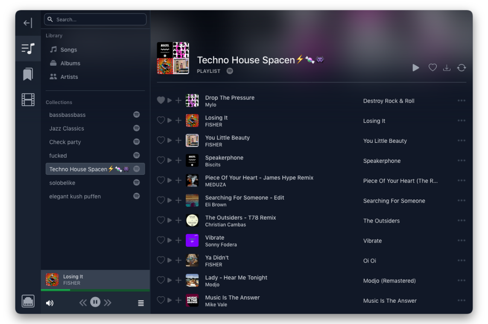

# Listmate



> A web application to manage your **_music, videos, bookmarks and more_** by synchornizing your lists with external services like **_YouTube, Spotify or Pocket_**.

<br>

## Concepts

### Everything is a DataObject / Resource

Every list item and associated data is represented as a `DataObject` in the database, and as a `Resource` in application logic.

_The reason for this separation is a `DataObject` is very much tied to database restrictions (and column types, as we use the Prisma ORM). On the other hand, a `Resource` doesn't care how the data is stored. This enables us to provide different database providers (like PostgreSQL) in the future, without having to change any application logic. Also, it is much easier to build custom typings for the different `ResourceType` types when that code is not auto-generated (as Prisma does)._

DataObjects can be linked together using a `ValueRef`. These **always** have a `.value` and may contain a `.ref`, which contains the `DataObject` ID to link to.
E.g. a `Song` resource has a `resource.values.artist` property, that is a ValueRef to a `Artist` resource.

Using this system makes it really easy to build resource types, that link to each other with automatic UI support.

<br>

### A DataObject can be linked to items on external services

For example a `Song` resource may have an equivalent in the Spotify database. To link them, a `DataObjectRemote` is created, that contains the `SourceType.SPOTIFY` and the respective `URI`.

By linking them, these two items become the logical "same".

A `DataObject` may contain multiple different `DataObjectRemote` entries.

<br>

### Lists can be created locally, or imported from external services

You can create lists locally, which can contain anything you want. You can also import lists from external services, but these can only contain types that the given API supports.

For example, you can import your Spotify playlists, and set the interval in which they should be synced.

**List content limitations:**

- Custom lists can contain any `ResourceType`
- Synced Spotify lists may only contain songs
  - Exception: Synced favourites (albums, artists, songs)
- Synced Pocket list may only contain bookmarks

_In the future, we may provide two-way syncing with selected providers, as not all of them provide appropiate APIs._

<br><br>

## Development

- Start dev server:

  ```sh
  npm run dev
  ```

This starts your app in development mode, rebuilding assets on file changes.

## GitHub Actions

We use GitHub Actions for continuous integration and deployment. Anything that gets into the `main` branch will be deployed to production after running tests/build/etc. Anything in the `dev` branch will be deployed to staging.
